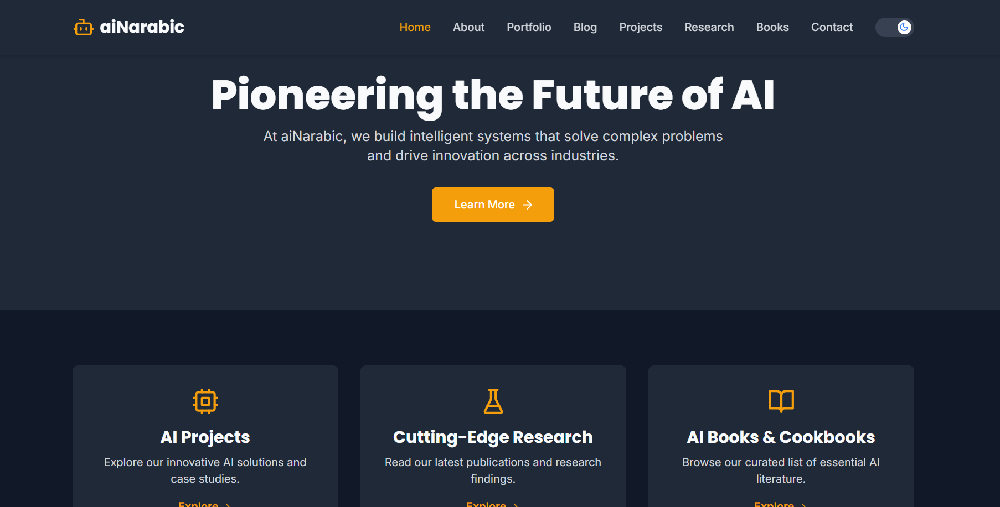

<!--
  For a great README, check out:
  - https://www.makeareadme.com/
  - https://github.com/othneildrew/Best-README-Template
  - https://github.com/matiassingers/awesome-readme
-->

<div align="center">
  <!-- TODO: Replace with your logo -->
  
  <h1 align="center">aiNarabic Website</h1>
  <p align="center">
    A modern, responsive, and feature-rich website for "aiNarabic" startup, built with the latest web technologies.
    <br />
    <a href="https://ainarabic.com"><strong>Explore the site »</strong></a>
    <br />
    <br />
    <a href="https://github.com/MohammedNasserAhmed/ainarabic-website/issues">Report Bug</a>
    ·
    <a href="https://github.com/MohammedNasserAhmed/ainarabic-website/issues">Request Feature</a>
  </p>
</div>

<div align="center">

[](https://opensource.org/licenses/MIT)
[](https://ainarabic-website.vercel.app/) <!-- TODO: Replace with your Vercel deployment link -->
[](https://github.com/MohammedNasserAhmed/ainarabic-website/pulls)

</div>

---

## 📋 Table of Contents

- [📋 Table of Contents](#-table-of-contents)
- [📖 About The Project](#-about-the-project)
  - [✨ Features](#-features)
  - [🛠️ Built With](#️-built-with)
- [🚀 Getting Started](#-getting-started)
  - [Prerequisites](#prerequisites)
  - [Installation](#installation)
- [💻 Usage](#-usage)
- [📂 Project Structure](#-project-structure)
- [🚢 Deployment](#-deployment)
- [🤝 Contributing](#-contributing)
- [📜 License](#-license)
- [📞 Contact](#-contact)
- [❓ FAQ](#-faq)

---

## 📖 About The Project

The **aiNarabic Website** is the official web presence for the "aiNarabic" initiative. It's designed to be a central hub for the Arabic-speaking community to explore the world of Artificial Intelligence. The platform is built from the ground up using a modern, performant, and scalable tech stack.

This repository contains the complete source code for the website, which is a Single Page Application (SPA) built with React and Vite.

<!-- TODO: Add a screenshot or GIF of the project -->
<div align="center">
  
</div>

### ✨ Features

*   **⚡ Blazing Fast:** Built with Vite for near-instant server start and Hot Module Replacement (HMR).
*   **🎨 Modern UI:** Styled with Tailwind CSS for a utility-first, highly customizable design.
*   **🎬 Smooth Animations:** Rich user experience with animations powered by Framer Motion.
*   **📱 Fully Responsive:** Looks great on all devices, from mobile phones to desktops.
*   **🧭 Client-Side Routing:** Seamless navigation handled by React Router.
*   **🔍 SEO Friendly:** Optimized for search engines using React Helmet Async.
*   **✒️ Clean Code:** Follows best practices with ESLint for code quality and consistency.

### 🛠️ Built With

This project leverages the power of modern open-source libraries and frameworks.

| Technology | Description |
| :--- | :--- |
| **React** | A JavaScript library for building user interfaces. |
| **Vite** | A next-generation frontend tooling that provides a faster and leaner development experience. |
| **Tailwind CSS** | A utility-first CSS framework for rapid UI development. |
| **Framer Motion** | A production-ready motion library for React. |
| **React Router** | The standard library for routing in React. |
| **Lucide React** | A beautiful and consistent icon toolkit. |
| **React Helmet Async** | A component to manage your document head. |

---

## 🚀 Getting Started

To get a local copy up and running, follow these simple steps.

### Prerequisites

Make sure you have Node.js and npm installed on your machine.

*   **Node.js** (v18.x or higher recommended)
    ```sh
    node -v
    ```
*   **npm** (comes with Node.js)
    ```sh
    npm -v
    ```

### Installation

1.  **Clone the repository**
    ```sh
    git clone https://github.com/your-username/ainarabic-website.git
    ```
2.  **Navigate to the project directory**
    ```sh
    cd ainarabic-website
    ```
3.  **Install NPM packages**
    ```sh
    npm install
    ```

---

## 💻 Usage

The project includes several scripts to help with development:

*   **Run the development server:**
    Starts the app in development mode with HMR. Open [http://localhost:5173](http://localhost:5173) to view it in the browser.
    ```sh
    npm run dev
    ```

*   **Build for production:**
    Bundles the app for production to the `dist` folder. It correctly bundles React in production mode and optimizes the build for the best performance.
    ```sh
    npm run build
    ```

*   **Lint your code:**
    Runs ESLint to check for code quality and style issues.
    ```sh
    npm run lint
    ```

*   **Preview the production build:**
    Serves the `dist` folder locally to preview the production build.
    ```sh
    npm run preview
    ```

---

## 📂 Project Structure

```
ainarabic-website/
├── public/             # Static assets (images, fonts, etc.)
├── src/
│   ├── assets/         # Non-component assets (CSS, images)
│   ├── components/     # Reusable React components
│   ├── constants/      # Site-wide constants
│   ├── hooks/          # Custom React hooks
│   ├── layouts/        # Layout components (Header, Footer, etc.)
│   ├── pages/          # Page components for routing
│   ├── App.jsx         # Main application component
│   └── main.jsx        # Entry point of the application
├── .eslintrc.cjs       # ESLint configuration
├── .gitignore          # Git ignore file
├── index.html          # Main HTML template for Vite
├── package.json        # Project dependencies and scripts
├── postcss.config.js   # PostCSS configuration
├── tailwind.config.js  # Tailwind CSS configuration
├── vercel.json         # Vercel deployment configuration
└── README.md           # You are here!
```

---

## 🚢 Deployment

This project is configured for seamless deployment to **Vercel**.

The `vercel.json` file in the root directory ensures that all routes are correctly handled by the client-side router, which is a standard requirement for Single Page Applications (SPAs).

```json
{
  "rewrites": [
    { "source": "/(.*)", "destination": "/index.html" }
  ]
}
```

To deploy, simply link your GitHub repository to a new Vercel project. Vercel will automatically detect the Vite configuration and deploy the site.

---

## 🤝 Contributing

Contributions are what make the open-source community such an amazing place to learn, inspire, and create. Any contributions you make are **greatly appreciated**.

If you have a suggestion that would make this better, please fork the repo and create a pull request. You can also simply open an issue with the tag "enhancement".

1.  **Fork the Project**
2.  **Create your Feature Branch** (`git checkout -b feature/AmazingFeature`)
3.  **Commit your Changes** (`git commit -m 'Add some AmazingFeature'`)
4.  **Push to the Branch** (`git push origin feature/AmazingFeature`)
5.  **Open a Pull Request**

Please make sure to update tests as appropriate.

---

## 📜 License

Distributed under the MIT License. See `LICENSE.txt` for more information.

<!-- TODO: Create a LICENSE.txt file with the MIT License text. -->

---

## 📞 Contact

Project Maintainer - **[Your Name]** - @your_twitter

Project Link: https://github.com/your-username/ainarabic-website

---

## ❓ FAQ

*   **Question 1: How can I add a new page?**
    *   Answer: Create a new component in `src/pages`, then add it to the router configuration in `src/App.jsx`.

*   **Question 2: Where can I change the color scheme?**
    *   Answer: The color palette is defined in `tailwind.config.js` under the `theme.extend.colors` object.

<!-- TODO: Add more FAQs as they arise. -->

